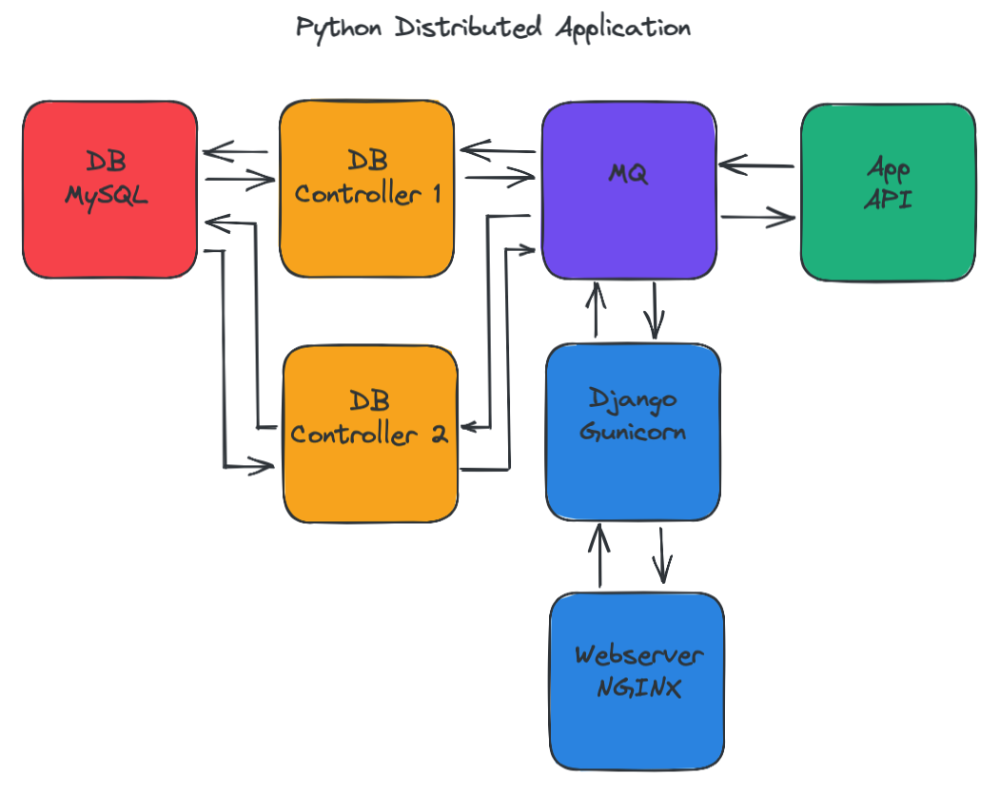

# Howdy 

## :seedling: Currenly Learning
- AWS Developer
- Kubernetes

## :spiral_notepad: To Do
- Jenkins
- ...
- ...
## :writing_hand: Code Examples
RestAPI: Golang, Gorilla, JWT, Bycrypt, OpenAPI

RestAPI: Python, FastAPI, JWT, Bcrypt, OpenAPI

## :construction: Current Project
Microservice architecture consisting of React, GoLang, Python, MySQL, MongoDB, Redis, REST, Linux, with deployment using Kubernetes and a version being designed for AWS infrastructure. Currently [in developement here](https://github.com/jaredmyers/groceryapp).

 <!-- it hurts me too.-->
  

## :round_pushpin: AWS GoLang RestAPI

Currently adding JWT, [lessons from this](https://github.com/jaredmyers/gogym/tree/main/api/gin_mongo) are being incorporated into the poject above :arrow_up:.

 <!-- it hurts me too.-->
  

## :round_pushpin: Last Project
If interested, [check out my last project](https://github.com/jaredmyers/social_app) where I designed a distributed system using Python, Django, Linux, RabbitMQ, RPC, and container orchestration with Docker Compose.

## :hammer_and_wrench: Languages and Tools  
<!--ooof... mixing html and markdown. my apologies. -->

  
  
  
  
  
  
  
  
  
  
  
  
  
  
  
  
  
  
  

 
  
  

 

----

